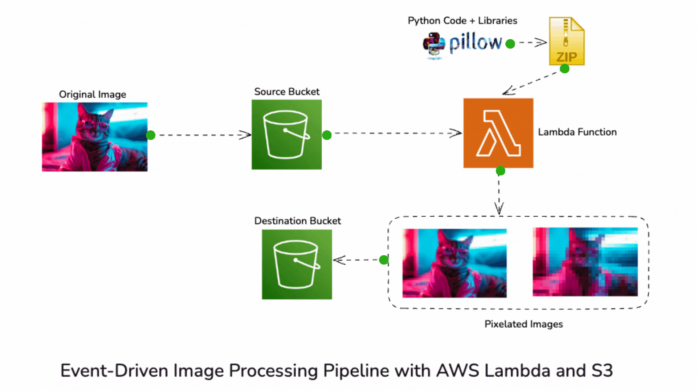

# Event-Driven Image Processing Pipeline with AWS Lambda and S3

This project demonstrates how to build an automated, event-driven image processing pipeline using AWS Lambda and S3. When an image is uploaded to a source S3 bucket, an AWS Lambda function is triggered, which processes the image by pixelating it into five different resolutions: 8x8, 16x16, 32x32, 48x48, and 64x64, using the Pillow (PIL) library. The processed images are then stored in a processed S3 bucket. This project leverages a fully serverless architecture, ensuring scalability and cost-effectiveness.

## What You Will Learn:

- AWS Lambda Event-Driven Architecture: How to trigger Lambda functions in response to S3 events.
- Image Processing with Python (Pillow Library): Techniques for manipulating images, including pixelation.
- S3 Bucket Operations: How to manage objects across multiple S3 buckets, including permissions and event notifications.
- Error Handling and Optimization: Implementing best practices for error handling in Lambda functions.
- Serverless Deployment: Experience deploying a fully serverless pipeline on AWS, ideal for real-time, automated tasks.

## Where Pixelation is Used:

Pixelation can be useful in several scenarios, including:

- Privacy Protection: Pixelating parts of images, such as faces or sensitive areas, is often used in media or public content to anonymize individuals.
- Creative Design: Pixelated images are popular in retro or abstract art, game design, and for stylized visual effects.
- Data Reduction: In applications where reduced image resolution is needed for quick previews or when bandwidth is limited, pixelation can be used to create smaller image files.
- Video and Image Compression: Pixelated previews are useful in scenarios where image or video quality can be progressively enhanced as more data is loaded.
- Blur Detection and Machine Learning: Pixelation can also be used in preprocessing images to test machine learning models on recognizing shapes, patterns, or when reducing visual noise is necessary for certain types of analysis.

## Project Solution:

### Stage 1: Create the S3 Buckets

- Bucket 1: amc-image-pixelater-source
- Bucket 2: amc-image-pixelater-processed

### Stage 2: Develop the Lambda Function Code:

- Create a folder named `my_lambda_deployment`.
- Move into that folder (`cd my_lambda_deployment`).
- Create a folder called `lambda`.
- Move into that folder (`cd lambda`).
- Create a file called `lambda_function.py` and paste in the code for the pixelator [Lambda function](https://github.com/conglytran0301/aws-project-image-pixelater/blob/main/lambda_function.py).
- Download this file [PIL](https://files.pythonhosted.org/packages/f3/3b/d7bb231b3bc1414252e77463dc63554c1aeccffe0798524467aca7bad089/Pillow-9.0.1-cp39-cp39-manylinux_2_17_x86_64.manylinux2014_x86_64.whl) Package into that folder.
- Run `unzip Pillow-9.0.1-cp39-cp39-manylinux_2_17_x86_64.manylinux2014_x86_64.whl` and then `rm Pillow-9.0.1-cp39-cp39-manylinux_2_17_x86_64.manylinux2014_x86_64.whl`. These are the Pillow module files required for image manipulation in Python 3.9 (which the lambda function will be using).
- From the same folder, run `zip -r ../my-deployment-package.zip .` which will create a lambda function zip, containing all these files in the parent directory.
- This zip will be the same zip which is linked below, so if you have any issues with the lambda function, you can use the one that's pre-created.

### Stage 3 - Create and Configure the Lambda Function

### Stage 4 - Test and Monitor

## Outcome:

By the end of this project, you will have a complete event-driven image processing pipeline capable of automatically pixelating images at multiple resolutions, with the processed images stored in a separate S3 bucket. This architecture is scalable, efficient, and can be adapted for other image processing tasks, providing a practical example of serverless computing in action.
# aws-project-image-pixelater


